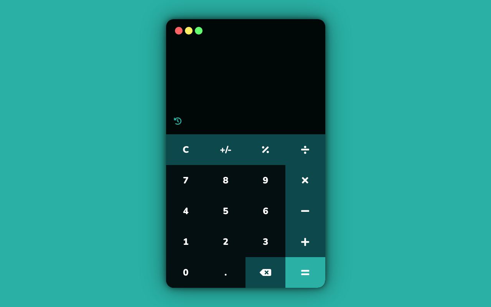

# Simple Calculator Web App
## Preview

  
This is a simple, responsive calculator web app built using HTML, CSS, and JavaScript. It allows users to perform basic arithmetic operations like addition, subtraction, multiplication, and division with a clean and intuitive interface.

## Website URL

[Calculator Web App](https://calculator.tholumuzi.co.za)

## Features

- **Basic Arithmetic**: Perform addition, subtraction, multiplication, and division.
- **Clear and Reset Function**: Easily clear the current input or reset the calculator.
- **Responsive Design**: Works seamlessly on desktop and mobile devices.
- **User-Friendly Interface**: A clean layout for easy use.

## Tech Stack

- **HTML5**: Markup for the structure of the calculator.
- **CSS3**: Styling for the design and responsiveness.
- **JavaScript**: Core functionality to handle calculations and user interactions.

## How to Use

1. Open the web app: [Calculator](https://calculator.tholumuzi.co.za)
2. Enter numbers and select the desired operation (add, subtract, multiply, divide).
3. Press the "=" button to see the result.
4. Use the "C" button to clear the input or the "AC" button to reset the calculator.

## Future Enhancements

- Adding more advanced mathematical functions (e.g., square roots, percentages).
- Improving accessibility features for enhanced usability.

## License

This project is open source and available for modification or contribution. Feel free to use it!

## Contact

For more information or to connect with me:

- **Portfolio**: [tholumuzi.co.za](https://tholumuzi.co.za)
- **GitHub**: [tholumuzikhuboni](https://github.com/tholumuzikhuboni)
